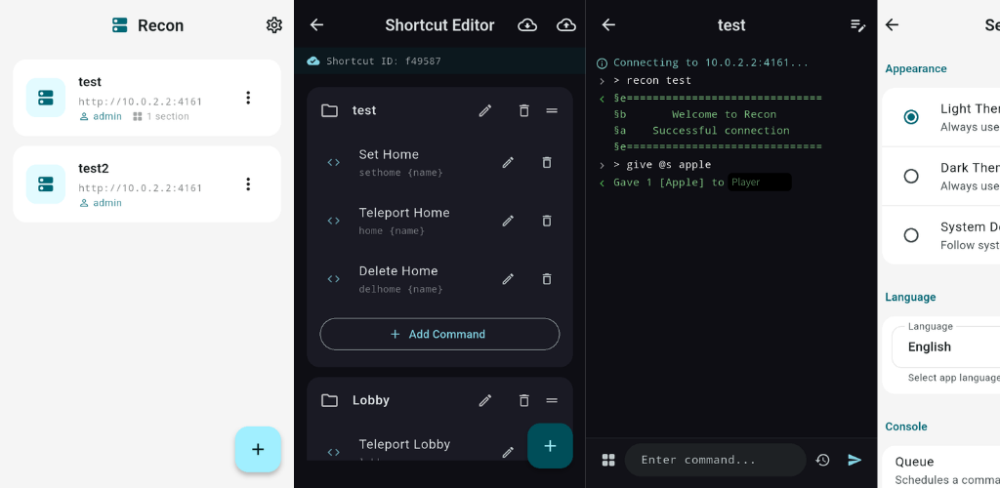

# Recon: The Next-Generation Remote Control tool for Minecraft

**Recon** is a modern, secure, and reliable REST API-based alternative to the traditional Minecraft RCON protocol. Designed for stability and ease of integration, Recon solves the common issues associated with RCON, such as connection drops, permission management difficulties, and inconsistent response handling.


## Why Recon?

The name **Recon** stands for three core principles:
- **Re**liable-con: Built for stability. No more random connection drops.
- **Re**sponse-con: Guaranteed command execution feedback.
- **Re**st-con: Uses a standard REST API (HTTP/JSON) for effortless integration with any modern platform.

## Key Features

- **🚀 REST API Protocol**: Ditch the clunky RCON packets for clean, standard HTTP requests.
- **🔒 Security**: Every request and response is encrypted using **AES**. Includes Nonce and Timestamp validation to prevent replay attacks.
- **👥 Per-User Permissions**: Manage API access for multiple users with individual settings for:
  - Whitelisted IP addresses.
  - OP privilege toggling.
  - Execution as a specific player.
- **📥 Command Queue**: If a player is offline when a command is sent, Recon can queue it to execute immediately upon their next login.
- **🌍 Multi-Language Support**: Built-in support for Arabic, German, English, Spanish, French, Hindi, Indonesian, Japanese, Portuguese, Russian, and Chinese.
- **🏗️ Multi-Platform Clients**: Ready-to-use client libraries for **PHP, Java, Python, JavaScript, TypeScript, Go, and Dart**.
- **⚡ High Performance**: Supports Paper, Folia (asynchronous), and BungeeCord/Velocity environments.

## Installation

1. Download the latest `Recon.jar` and place it in your server's `plugins` folder.
2. Restart the server to generate configurations.
3. Configure the HTTP port (default: `4161`) and other settings in [config.yml](src/main/resources/config.yml).
4. Use the `/recon` command in-game to create your first API user.

## API Specification

Recon listens for `POST` requests at the root path (`/`).

### Request Body
```json
{
  "user": "username",
  "nonce": "random_string",
  "timestamp": 1234567890,
  "queue": true,
  "command": "AES_ENCRYPTED_COMMAND"
}
```

`queue` is optional and defaults to `false`.

- If `allow-queue-for-all-users: true` in `config.yml`, queue is enabled when request has `queue: true`.
- If `allow-queue-for-all-users: false`, request `queue: true` is ignored by default.
- Even when global setting is `false`, users with `queue: true` in `users.yml` can still use queue.

### Response Body
```json
{
  "user": "username",
  "nonce": "server_random_string",
  "timestamp": 1234567890,
  "success": true,
  "response": "AES_ENCRYPTED_RESPONSE",
  "error": "Error message (only if success is false)"
}
```

## Commands

| Command | Short Form | Description | Permission |
|---------|------------|-------------|------------|
| `/recon create user:<name> password:<pw> [ip:<ip>] [op:<bool>] [player:<name>]　[queue:<bool>] [permission:<perm>]` | `/recon create u: pw: [i:] [o:] [pl:] [q:] [pe:]` | Create a new profile for a specific user or player. | `recon.create.other.*` |
| `/recon create password:<pw> [ip:<ip>] [op:<bool>] [queue:<bool>] [permission:<perm>]` | `/recon create pw: [i:] [o:] [q:] [pe:]` | Create your own profile (target is yourself). | `recon.create.own.*` |
| `/recon edit user:<name> [password:<pw>] [ip:<+/-ip>] [op:<bool>] [queue:<bool>] [player:<name>] [permission:<+/-perm>]` | `/recon edit u: [pw:] [i:] [o:] [q:] [pl:] [pe:]` | Edit a specific user's profile. Use `+` or `-` for IPs/Perms. | `recon.edit.other.*` |
| `/recon edit [password:<pw>] [ip:<+/-ip>] [op:<bool>] [queue:<bool>] [permission:<+/-perm>]` | `/recon edit [pw:] [i:] [o:] [q:] [pe:]` | Edit your own connection profile. | `recon.edit.own.*` |
| `/recon info [user:<name>]` | `/recon info [u:]` | View profile details for yourself or another user. | `recon.info.own` / `recon.info.other` |
| `/recon test` | - | Test connection stability and credentials. | (None) |
| `/recon reload` | - | Reload configuration and language files. | `recon.reload` |
| `/recon remove user:<name>` | `/recon remove u:` | Remove a user connection profile. | `recon.remove` |

* Permissions can be set to `group.default`, `worldedit.*`, etc.
---

## Client Libraries

Check the [examples/](examples/) directory for sample implementations in various languages:
- [Dart](examples/Dart/example.dart)
- [Go](examples/Go/example.go)
- [Java](examples/Java/Example.java)
- [JavaScript](examples/JavaScript/example.js)
- [PHP](examples/PHP/example.php)
- [Python](examples/Python/example.py)
- [TypeScript](examples/TypeScript/example.ts)

## Mobile Application
Recon is the Next-Generation Remote Control tool for Minecraft—an RCON alternative designed for both players and admins. 🚀
This plugin includes a function to automatically generate individual connection profiles for every player. These profiles allow players to enjoy a more streamlined gameplay experience by leveraging the application's shortcut capabilities. ✅
Shortcuts can be uploaded to the cloud and shared by entering an ID. ☁



> [!IMPORTANT]
> This application is a smartphone client for Recon. To use it, you must first install the Recon plugin on your server.

Get it on [Google Play](https://play.google.com/store/apps/details?id=com.enabify.recon) or [App Store]().

## License

Copyright (c) 2026 Enabify. Licensed under the MIT License with additional restrictions regarding mobile application distribution. See [LICENSE](LICENSE) for details.

> **Note**: Redistribution of this software as a mobile application on any digital app store is exclusively reserved for Enabify.